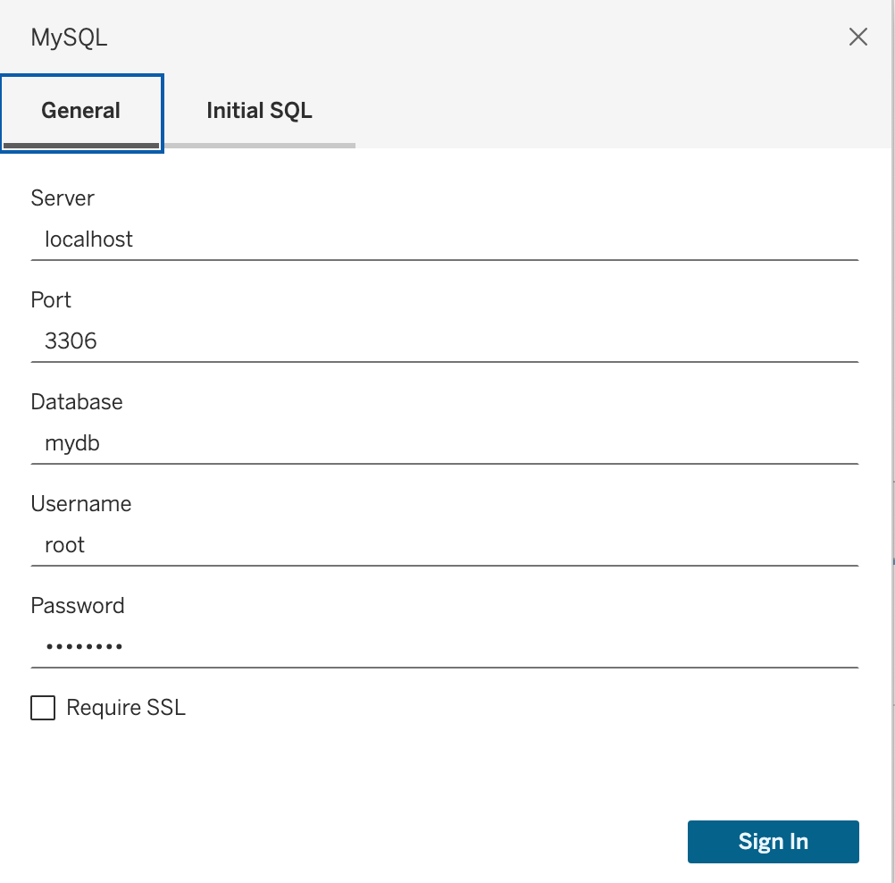
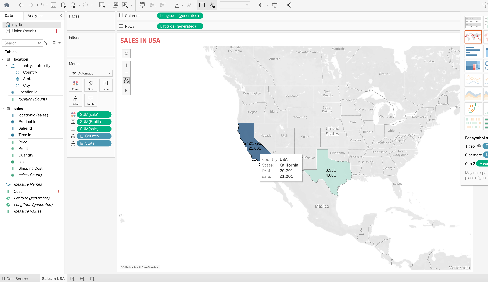
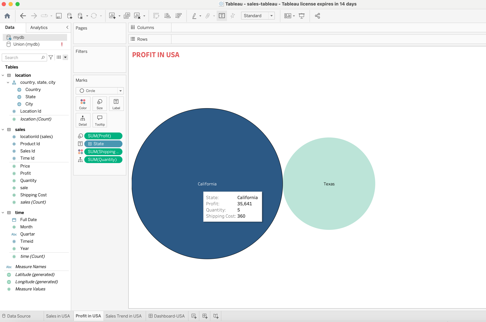
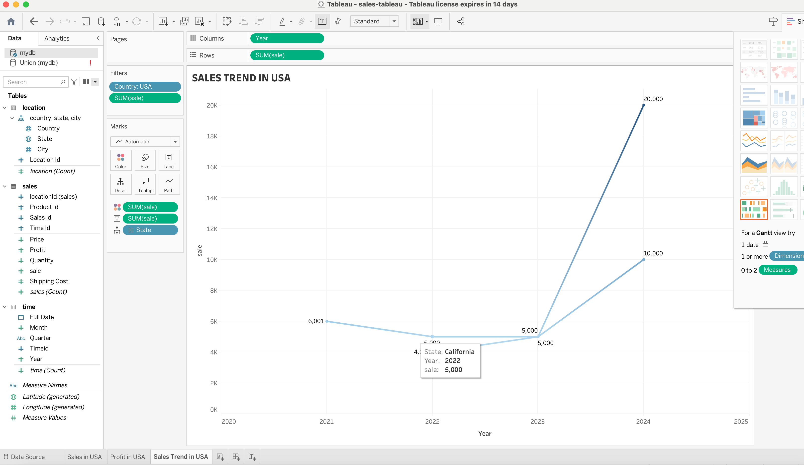
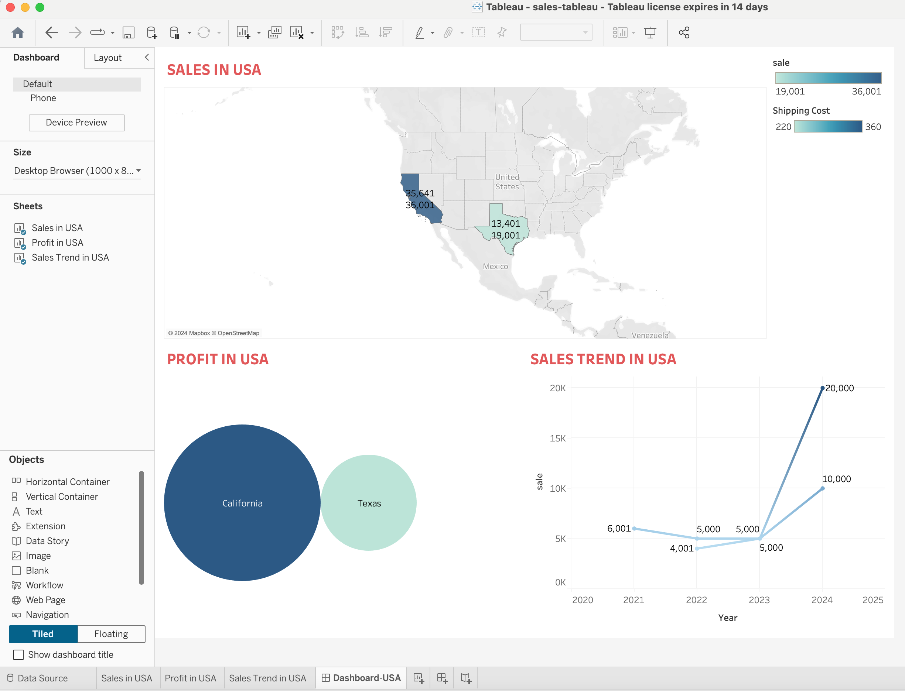

## Advanced Data Analytics for Sales in USA
To interface with the database and access relevant data, create a data source connection by navigating to the "Connect Pane" and establishing a link to the MySQL database.

### Sales in USA
Data shows in Geo charts with color and label.

##  Profit in USA
Data shows in comparing size and color for shipping cost and profit in each state.

## Sales Trends in USA
Data Shows slaes overtime and the trends.

## Dashboard 
Dashboard integrating all three worksheets together.

