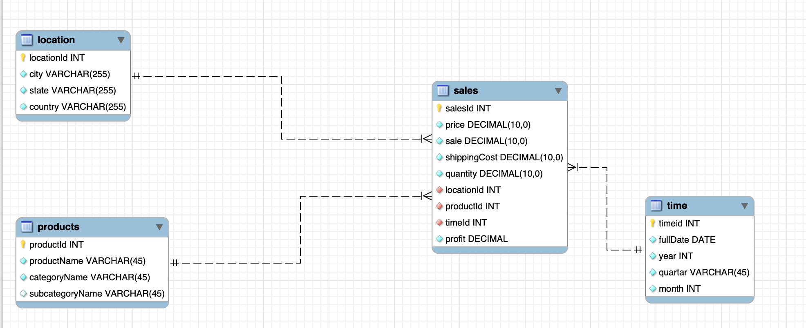

## ER Diagram for tracking sales and order of store:

## Dimensional Data Modling
To effectively design a dimensional data model, it is essential to address four critical considerations:
- the business purpose
- the gain
- dimensions
- facts
- ## Star Schema
In this case the store only wants to focus on sales, Locations, time.

